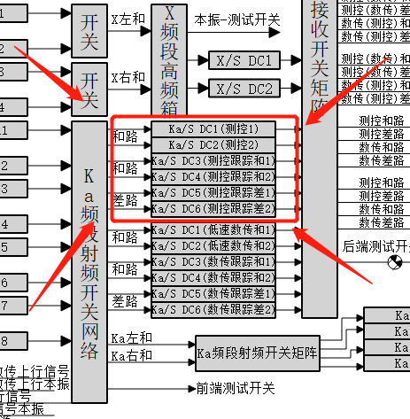
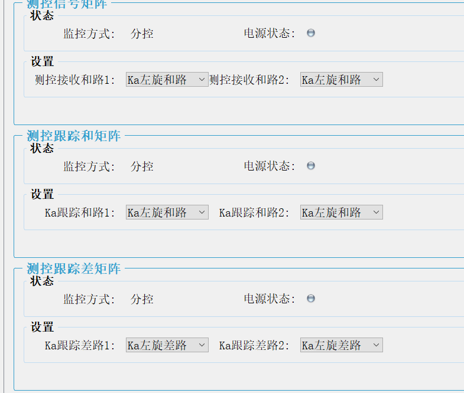
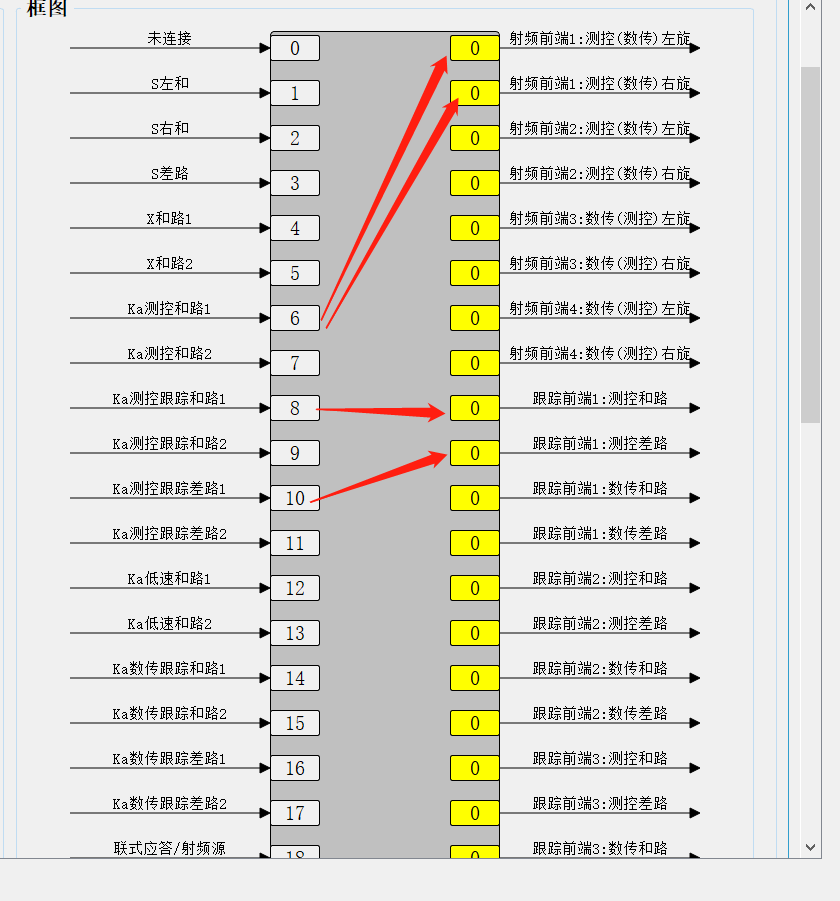
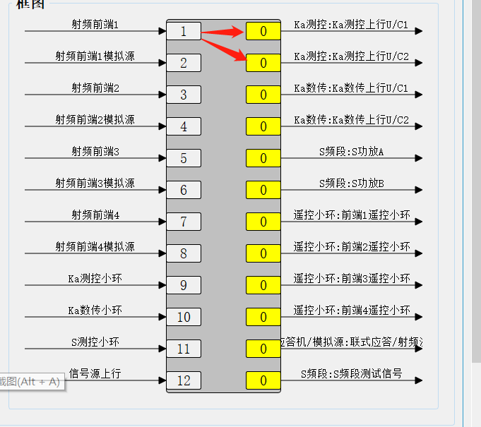

## 步骤一 配置驱动控制设备
***

本步骤主要是控制信号来源，信号来源是ACU，经过的第一个设备就是驱动控制，可以通过控制以下开关进行控制，

*   左旋和路使用Ka-LNA1或者Ka-LNA2,这两个只是AB备份信号只需要通过经过其中一个场放单元
*   右旋和路使用Ka-LNA3或者Ka-LNA4,这两个只是AB备份信号只需要通过经过其中一个场放单元
*   左旋差路使用Ka-LNA5或者Ka-LNA6,这两个只是AB备份信号只需要通过经过其中一个场放单元
*   右旋差路使用Ka-LNA7或者Ka-LNA8,这两个只是AB备份信号只需要通过经过其中一个场放单元

## 步骤二  配置Ka射频开关网络
***

信号经过场放后到Ka射频开关网络，双击系统框图（Ka射频开关网络）或者在菜单栏选择--设备监控--高频接收--选择Ka射频开关网络

*   Ka左旋和路选择与驱动控制设备保持一致(上图选择的是Ka-LNA1)
*   Ka右旋和路选择与驱动控制设备保持一致(上图选择的是Ka-LNA3)
*   Ka左旋差路选择与驱动控制设备保持一致(上图选择的是Ka-LNA5)
*   Ka右旋差路选择与驱动控制设备保持一致(上图选择的是Ka-LNA7)

## 步骤三 配置Ka测控及跟踪高频箱
信号经过开关网络后到Ka测控及跟踪高频箱，

双击系统框图

或者在菜单栏选择--设备监控--高频接收--选择Ka测控及跟踪高频箱

*   测控信号矩阵--测控接收和路1使用Ka左旋和路
*   测控信号矩阵--测控接收和路2使用Ka左旋和路
*   测控跟踪和矩阵--Ka跟踪和路1使用Ka左旋和路
*   测控跟踪和矩阵--Ka跟踪和路2使用Ka左旋和路
*   测控跟踪差矩阵--Ka跟踪差路1使用Ka左旋差路
*   测控跟踪差矩阵--Ka跟踪差路2使用Ka左旋差路
*   增益的参考值为40dB。

## 步骤四 配置S频段接收开关矩阵

### 信号输入输出

信号经驱动控制，S频段高频箱，进入S频段开关矩阵

*   输入 Ka测控和路1、Ka测控和路2、Ka测控跟踪和路1、Ka测控跟踪和路2、Ka测控跟踪差路1、Ka测控跟踪差路2

*   输出 射频前端、跟踪前端
    *   射频前端有2个输入口
        *   这两个输入口其实不区分左右旋的，但是一般就按矩阵上的命名接就行,交换一下其实也是没问题的,只是配列组合增多增加了很多复杂度
    *   跟踪前端有4个输入口 
        *   前两路做测控（一个测控跟踪和路输入，一个测控跟踪差路输入）
        *   后两路信号做数传跟踪（一个跟踪和路输入，一个跟踪差路输入）

### 使用射频前端1和跟踪前端1为例

*   Ka测控和路1(X6)接入射频前端1的左旋选输入
*   Ka测控和路1(X6)接入射频前端1的右旋选输入
*   Ka测控跟踪和路1(X8)接入跟踪前端的测控和路
*   Ka测控跟踪差路1(X10)接入跟踪前端的测控差路

##  步骤五 检查光口网络是否配置好
***

这里的光口网络检查分为 

*   射频数字化前端和测控基带光口网络检查
*   跟踪数字化前端和跟踪基带光口网络检查

这两种的检查方式是一样的 这里使用 **射频数字化前端和测控基带** 来举例说明

### 查看测控基带光口网络状态  

    如果查看测控基带时,基带软件的界面按钮都是灰色的点击无效 则需要先登录
    点击测控基带菜单栏--系统管理--用户登录--选择administrator--点击登录

    点击测控基带菜单栏-工具-光口网络设置

### 查看测控数字化前光口网络状态

    点击射频数字化前端菜单栏--参数管理—-万兆网络(主)/ 万兆网络(备)

### 检查网络地址是否正确

-    基带的主网IP地址需要和前端的万兆网络(主)中的基带网络IP地址一致
-    基带的备网IP地址需要和前端的万兆网络(备)中的基带网络IP地址一致
-    基带的目的IP地址需要和前端的万兆网络(主)中的本地网络IP地址一致
-    基带的目的IP地址2需要和前端的万兆网络(备)中的本地网络IP地址一致

注意:

1.总共有4个射频数字化前端,理论上是既可用作测控也可用作数传,实际上是射频数字化前端1和2 默认用做测控 3和4用作数传 在自动化运行时是被软件限制了的,但是可以通过单独的设备控制，如果无特别情况请勿打破此种限制

2.基带与前端的对应关系只能是一对一,如果出现一对多或者多对一的情况,反映出来的结果就是数据乱包

3.跟踪基带与跟踪前端是物理连接的一一对应的不可更改 且当前是设置的默认12高速用 34低速用 

### 检查基带通道状态

    通道锁定状态为锁定 且丢包计数值很小不会一直增长 但通道报序列号在不停变换 此时光网通道是正常的

    如果不是则需要检查网络配置或者硬件

###	检查前端通道状态

    前端主界面中光路状态为绿色 且丢包统计很小不会一直增长 单接收数据包号在不断变换 此时光网通道是正常的

    如果不是则需要检查网络配置或者硬件

## 步骤六 配置S频段发射开关矩阵
***

    信号从射频数字化前端到功放需要经过S频段发射开关矩阵
    此处的信号是从前端到功放
    此矩阵很直观直接将功放和前端连接在一起就行了
    

    以Ka测控功放和前端1为例

## 步骤七  配置角误差单元(视频切换单元)
***

    角误差切换单元只需要将Ka测控的角误差选择当前的跟踪基带即可

注意:假设当前我只用S且基带为跟踪A 但是我同时也把Ka测控和Ka数传的也设置误差为跟踪A输出 此时ACU的Ka测控和Ka数传也会显示有agc 但是却无法正常使用 其他同理 
