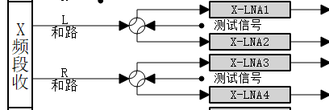
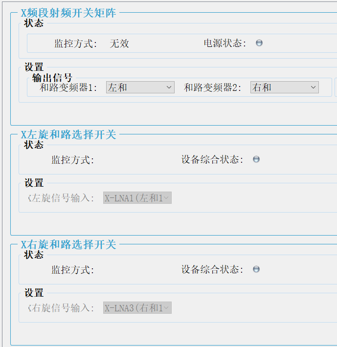
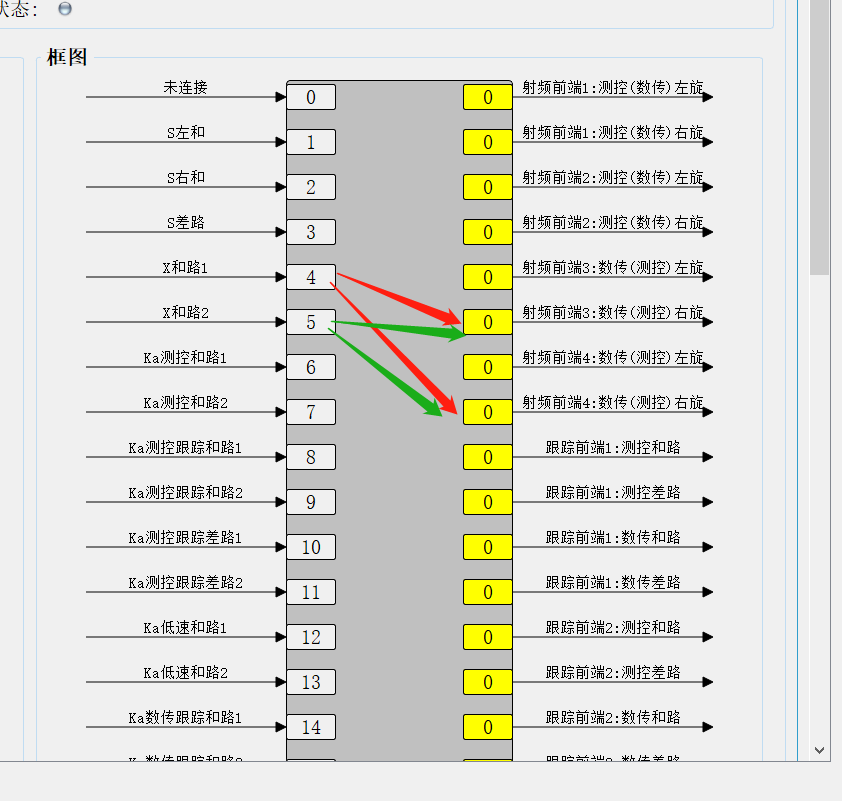

## 步骤一 配置驱动控制设备
***

本步骤主要是控制信号来源，信号来源是ACU，经过的第一个设备就是驱动控制，可以通过控制以下开关进行控制，

*   左旋和路使用X-LNA1或者X-LNA2 这两个只是AB备份信号只需要通过经过其中一个场放单元
*   右旋和路使用X-LNA3或者X-LNA4 这两个只是AB备份信号只需要通过经过其中一个场放单元

*   X路场放

## 步骤二  配置X频段高频箱
***

*   X左旋和路选择开关的信号输入同步骤一选择的场放   如果是上图的话应该选择X-LNA1
*   X右旋和路选择开关的信号输入同步骤一选择的场放   如果是上图的话应该选择X-LNA3
*   X频段射频开关矩阵和路变频器1接 左和
*   X频段射频开关矩阵和路变频器2接 右和
*   和路变频器的增益的参考值为40dB

## 步骤三 配置S频段接收开关矩阵

### 信号输入输出

信号经驱动控制，X频段高频箱，进入S频段开关矩阵

*   输入 X左和、X右和
*   输出 射频前端
    *   射频前端有2个输入口 这里一般约定的是
        *   输入口1用做Ka数传
        *   输入口1用做X数传

### 接入射频前端

*   X左旋和路(X4)接入射频前端3的第二输入口
*   X左旋和路(X4)接入射频前端4的第二输入口
*   X左旋和路(X5)接入射频前端3的第二输入口
*   X左旋和路(X5)接入射频前端4的第二输入口

##  步骤四 检查光口网络是否配置好
***

这里的光口网络检查分为 

*   射频数字化前端和低速数传基带光口网络检查

### 查看低速数传基带光口网络状态  

    如果查看低速数传基带时,基带软件的界面按钮都是灰色的点击无效 则需要先登录
    点击低速数传基带菜单栏--系统管理--用户登录--选择administrator--点击登录

    点击低速数传基带菜单栏-软件工具-光口网络设置

### 查看测控数字化前光口网络状态

    点击射频数字化前端菜单栏--参数管理—-万兆网络(主)/ 万兆网络(备)

### 检查网络地址是否正确

-    基带的主网IP地址需要和前端的万兆网络(主)中的基带网络IP地址一致
-    基带的备网IP地址需要和前端的万兆网络(备)中的基带网络IP地址一致
-    基带的目的IP地址需要和前端的万兆网络(主)中的本地网络IP地址一致
-    基带的目的IP地址2需要和前端的万兆网络(备)中的本地网络IP地址一致

注意:

1.总共有4个射频数字化前端,理论上是既可用作测控也可用作数传,实际上是射频数字化前端1和2 默认用做测控 3和4用作数传 在自动化运行时是被软件限制了的,但是可以通过单独的设备控制，如果无特别情况请勿打破此种限制

2.基带与前端的对应关系只能是一对一,如果出现一对多或者多对一的情况,反映出来的结果就是数据乱包

3.跟踪基带与跟踪前端是物理连接的一一对应的不可更改 且当前是设置的默认12高速用 34低速用 

### 检查基带通道状态

    通道锁定状态为锁定 且丢包计数值很小不会一直增长 但通道报序列号在不停变换 此时光网通道是正常的

    如果不是则需要检查网络配置或者硬件

###	检查前端通道状态

    前端主界面中光路状态为绿色 且丢包统计很小不会一直增长 单接收数据包号在不断变换 此时光网通道是正常的

    如果不是则需要检查网络配置或者硬件

