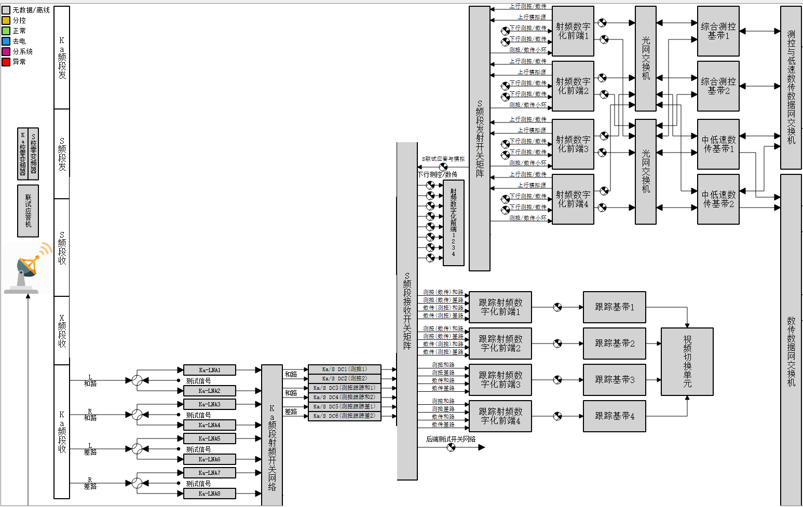
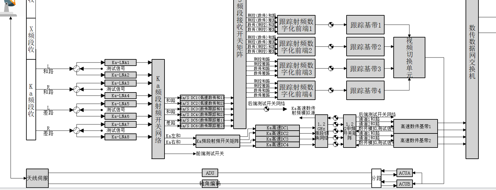

# S频段链路配置

S频段链路主要包含以下设备
*   驱动控制
*   S射频开关网络（S频段高频箱）
*   S频段接收开关矩阵
*   跟踪前端
*   跟踪基带
*   射频前端
*   测控基带
*   S频段发射开关矩阵
*   S功放

 

任务中，主要旋向包含以下3种，S频段单左旋信号，单右旋信号，左右旋同时。以下是对每一种情况的链路分解和开关控制。

## [S单左旋信号链路配置](./S单左旋信号链路配置.md)
## [S单右旋信号链路配置](./S单右旋信号链路配置.md)
## [S左右旋同时链路配置](./S左右旋同时链路配置.md)

# X链路配置

X频段主要是数传,包含以下设备
*   驱动控制
*   X射频开关矩阵(X频段高频箱)
*   S频段接收开关矩阵
*   射频前端
*   中低速数传基带

 

在任务中X一般是走数传没有测控，且一般没有左右旋同时的情况

一般任务就是单左旋 单右旋

## [X低速链路配置](./X低速链路配置.md)

# Ka扩2链路配置
***

Ka扩2链路主要包含以下设备
*   驱动控制
*   Ka射频开关网络
*   Ka测控及跟踪高频箱
*   S频段接收开关矩阵
*   跟踪前端
*   跟踪基带
*   射频前端
*   测控基带
*   S频段发射开关矩阵
*   Ka测控功放

 

任务中，主要旋向包含以下3种，Ka遥测左旋、Ka遥测右旋，Ka遥测左右旋同时。以下是对每一种情况的链路分解和开关控制。

## [Ka遥测单左旋信号链路配置](./Ka遥测单左旋信号链路配置.md)
## [Ka遥测单右旋信号链路配置](./Ka遥测单右旋信号链路配置.md)
## [Ka遥测左右旋同时链路配置](./Ka遥测左右旋同时链路配置.md)

# Ka低速数传链路配置
***

Ka低速数传链路主要包含以下设备
*   驱动控制
*   Ka射频开关网络
*   Ka低速数传及跟踪高频箱
*   S频段接收开关矩阵
*   跟踪前端
*   跟踪基带
*   射频前端
*   低速数传基带
*   S频段发射开关矩阵
*   Ka数传功放

 

任务中，主要旋向包含以下3种，Ka低速左旋、Ka低速右旋，Ka低速左右旋同时。以下是对每一种情况的链路分解和开关控制。

## [Ka低速单左旋信号链路配置](./Ka低速单左旋信号链路配置.md)
## [Ka低速单右旋信号链路配置](./Ka低速单右旋信号链路配置.md)
## [Ka低速左右旋同时链路配置](./Ka低速左右旋同时链路配置.md)

# Ka高速数传
***

Ka高速数传链路主要包含以下设备
*   驱动控制
*   Ka射频开关网络
*   Ka低速数传及跟踪高频箱
*   S频段接收开关矩阵
*   跟踪前端
*   跟踪基带
*   Ka高速数传高频箱
*   L频段切换网络
*   L频段中频矩阵
*   高速数传基带

 

高速数传这里可以多路接收

分为以下几种情况

*   单点频
    *   左旋
    *   右旋
    *   左右旋同时
*   双点频

链路配置如下

## [Ka高速单左旋信号链路配置](./Ka高速单左旋信号链路配置.md)
## [Ka高速单右旋信号链路配置](./Ka高速单右旋信号链路配置.md)
## [Ka高速左右旋同时链路配置](./Ka高速左右旋同时链路配置.md)
## [Ka高速双点频链路配置](./Ka高速双点频链路配置.md)

