# 4426自动化运行流程

4426自动化运行分为任务准备，校零，转等待点，任务开始阶段，校相，自跟踪，任务结束。

[TOC]


## 1.任务准备

任务准备阶段主要需要完成参数宏下发，配置任务链路，给DTE，ACU下发任务计划等。以下每一步是按照时间顺序进行下发。

### 1.1 ACU相关控制

#### 1.1.1 ACU任务计划

由于ACU需要DTE的轨道数据，且ACU本地判断了任务准备开始时间，所以ACU计划放在最前面。对应计划如下

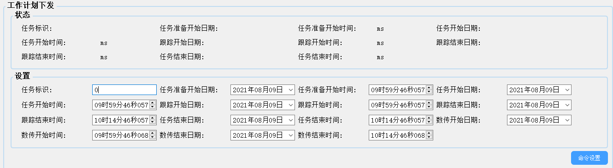

#### 1.1.2 ACU公共单元参数下发

#### 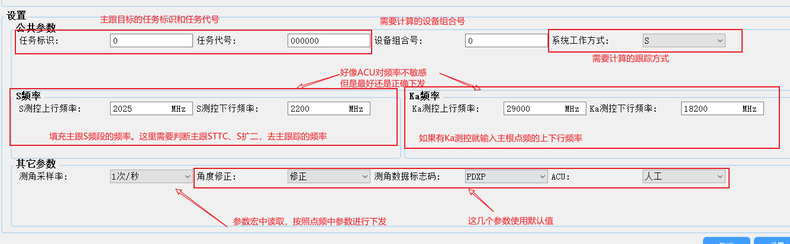1.1.3 ACU天线控制

从主根的设备参数中获取，这部分参数应该是相同的，参数宏中配置默认值。

#### 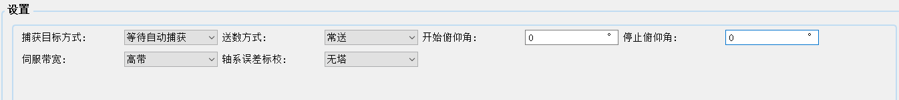1.1.4 ACU极化控制

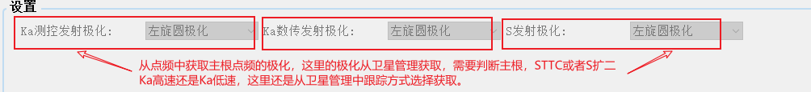

### 1.2 DTE相关控制

#### 1.2.1 DTE加载任务命令

这里加载任务只需要判断主根目标和点频进行参数下发

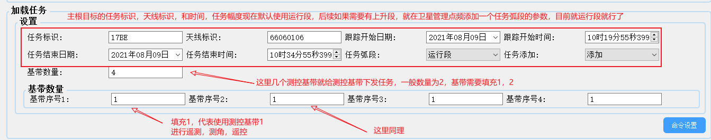

#### 1.2.2 DTE申请轨道根数

在DTE加载任务计划后给DTE下发申请轨道根数命令，这里DTE会从中心获取实时的轨道信息，然后把轨道根数传给ACU，随后ACU调用计算程序，算出当前的进站时间和出站时间

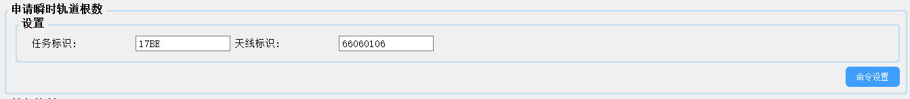

### 1.3 参数宏、配置宏下发

根据不同的链路下发参数宏和配置宏

```bash
#注意事项
1.在自动化运行流程中，需要判断的是主根目标，就是卫星管理跟踪方式选择。当前任务是Sttc，S扩二，X低速，Ka低速，但是卫星管理又是Ka高速，这时候就需要重新计算卫星的跟踪方式。
2.STTC和S扩2同时存在的时候，需要判断卫星管理的跟踪方式，因为STTC和S扩二只能一个进行跟踪。
举例，一任务是标准TTC和S扩二单点频任务，STTC左旋，S扩二右旋，此时就需要从卫星管理获取当前的跟踪方式，这个参数放在tasktimeList中,这里需要将S差路信号切换正确。
同理，一任务是Ka高速和Ka低速同时运行的时候，也需要判断主根Ka高速还是Ka低速，也是从卫星管理中获取当前的跟踪方式，如果主跟ka高速，就把高速的频点下发给Ka低速数传跟踪高频箱，如果是Ka低速就把点频下发给Ka低速数据高频箱。这部分参数都是跟踪参数。
3.参数宏、配置宏下发时间优化。目标在2分钟半内能正常下发，STTC，S扩二，Ka低速，X低速，Ka高速的宏和链路。
4.通过卫星的跟踪方式来给ACU和视频切换单元下发参数。
5.角误差需要根据跟踪基带是什么模式然后进行下发。信号也要对应切换过去。
```

### 1.4 角误差信号下发

#### 1.4.1 角跟踪单元参数设置

这里指的是给视频切换单元下发对应参数及给跟踪基带下发命令

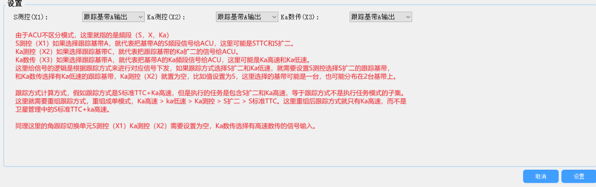

#### 1.4.2跟踪基带过程命令控制

这里需要跟踪方式选择，来通知跟踪基带那一台设备来执行天线的快速校相。这里命令外场调试

### 1.5 ACU设置自动化运行命令

下发自动化运行命令后，ACU可以进行轨道根数计算。并且ACU进入自动化运行模式。

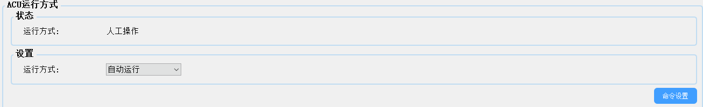

### 1.6 关闭对应设备存盘送数。

给基带下发停止存盘和送数的命令，这一步主要是防止基带直接给DTE送错误数据。

------


## 2.校零

本步骤需要做的事情是根据任务的频段进行零值标校。需要校零的是STTC，S扩二，Ka扩二，能执行的校零基带数目为2，等于只能同时进行2种模式的校零。

### 2.1 调用一键校零，切换为校零模式

### 2.2 给测控基带下发校零命令，等待校零结果上报，结果入库，恢复任务方式


## 3.转等待点

本步骤主要控制ACU进行等待点，然后程引引导卫星到对应位置。

### 3.1 下发转等待点命令

等待结果上报，如果结果是指向到位，就退出循环，超时时间30s.

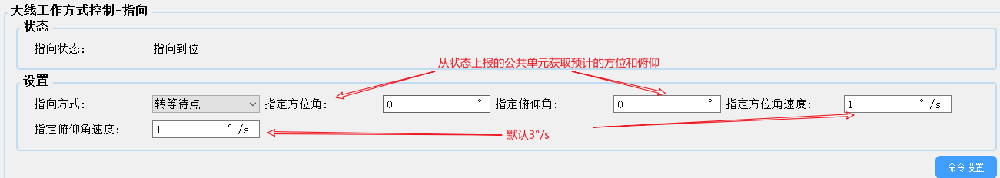

### 3.2 下发程引命令

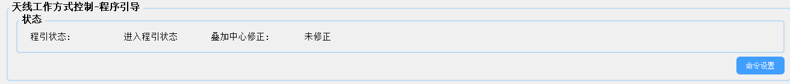


## 4.任务开始

本步骤主要控制基带开启存盘送数等相关命令，及给DTE，ACU下发对应送数控制命令。

### 4.1 基带存盘、送数控制

### 4.2 DTE送数控制

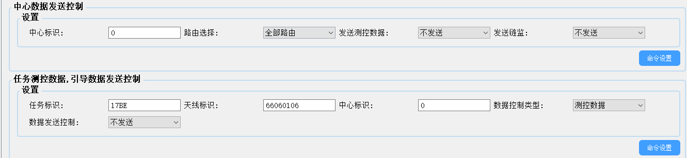

### 4.3 ACU送数控制

控制ACU送数给DTE，DTE能实时收到ACU角度，然后对比程引数据，然后可以送数给ACU进行方位、俯仰角度控制。

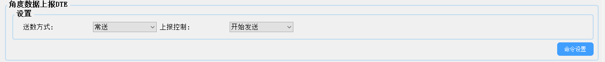

## 5.快速校相

### 5.1 正常快速校相

下发快速校相命令，接收校相结果，ACU下发任务开始命令

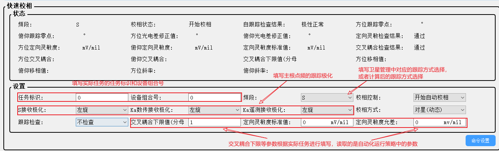

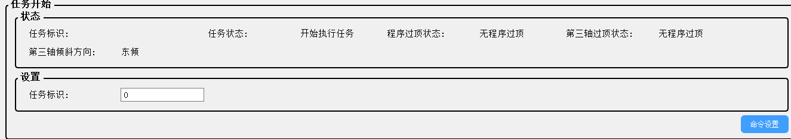

### 5.2 不进行校相或者校相失败

ACU下发任务开始命令


## 6 发上行

### 6.1 发遥控

如果全0就不发遥控，如果全F 直接发遥控，如果是对应时间发上行就判断时间 然后发上行

主要命令如下：

1.基带遥控加调，遥测加调，上行载波输出（不同基带对应上行的命令不同）

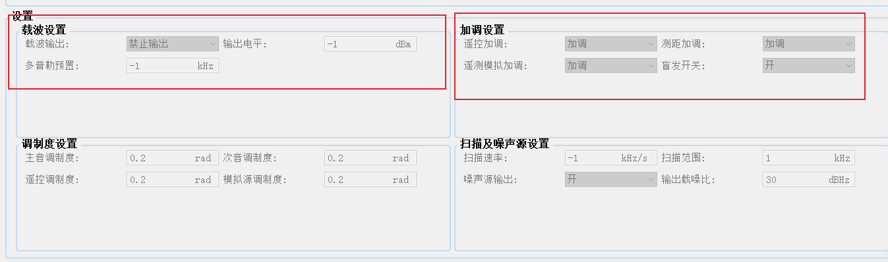

2.功率上天线命令

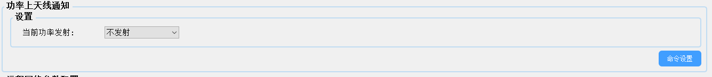

3.功放功率输出

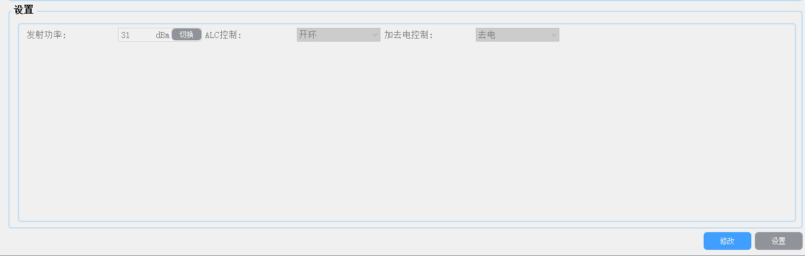

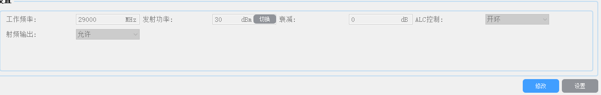

4.S功放RF开关打开

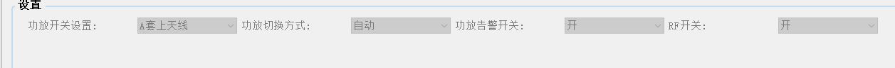

### 6.2 发上行

如果全0就不发遥控，如果全F 直接发遥控，如果是对应时间发上行就判断时间 然后发上行

主要命令如下：

1.ka低速输出基带上行调制单元载波输出

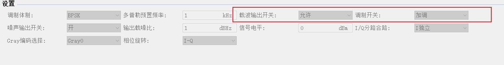

2.ka数传功放加激励

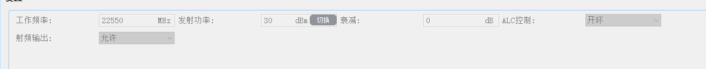


## 7 任务结束

### 7.1 停止存盘送数

### 7.2 关功放

### 7.3 ACU停止送数给DTE