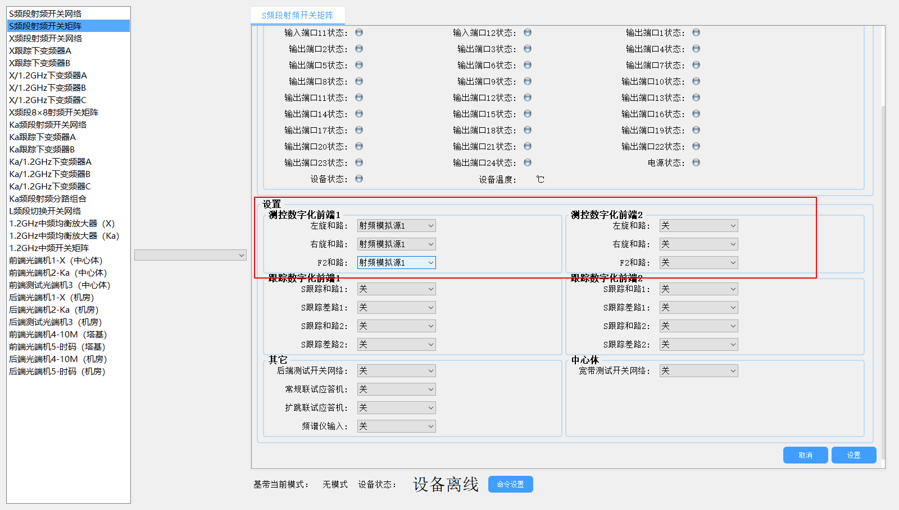
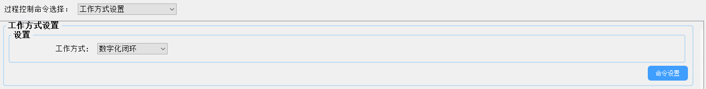
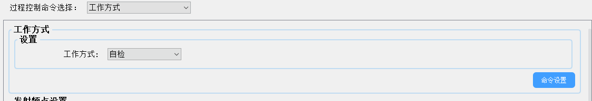
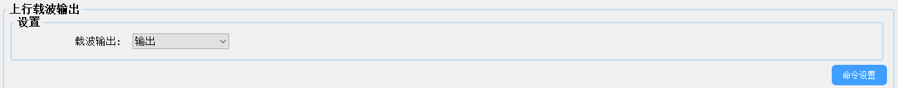
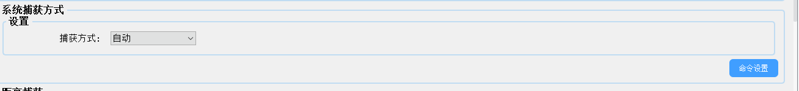
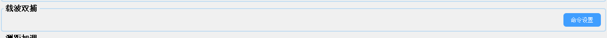
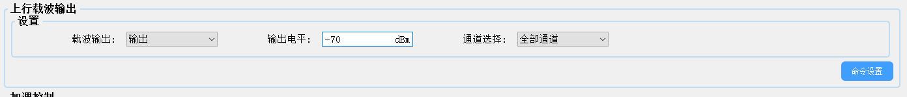

#### 配置宏链路控制 

### 1.S频段相关

#####     第一步

根据配置宏和资源重组获取使用的前端和测控基带信息，如果是前端1和基带1 就前端1就要选择模拟元1的信号，如果是前端2基带1后面的开关对应就要选择前端2，这里选择的射频模拟元几就是对应基带几

##### 第二步

设置基带工作方式为数字化闭环

前端设置工作方式为自检（好像又不需要）

##### 第三步

光口网络配置

给基带和前端下发网络配置

##### 第四步

标准TTC载波输出

其他模式如下加调

### 2.X频段/Ka频段

