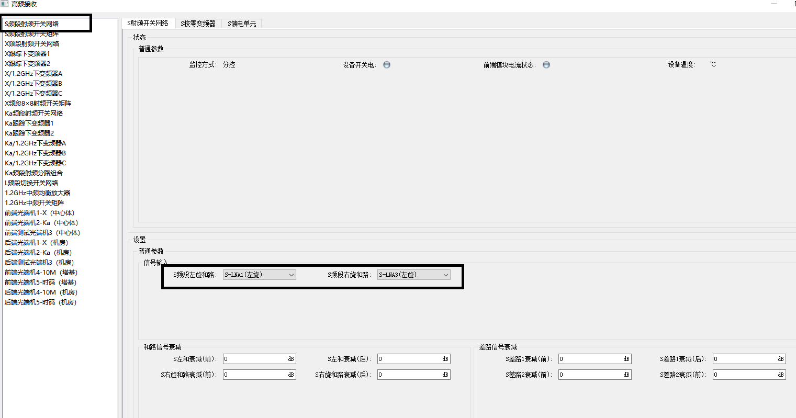

#### 配置宏链路控制 

### 1.S频段相关

​    参考系统框图，信号我们只用关心是左旋信号还是右旋信号输入，信号流向 S-LNA-N   ---> S接收矩阵 ---> S接收矩阵开关矩阵  ---> 测控前端N ---> S频段发射矩阵 --->S功放

已上面链路为例

#####  第一步

信号是选择的S-LNA1 和S-LNA5，需要控制进行场放控制，如果右旋没选，S和路右旋开关的S-LNA3 /S-LNA4 就保存上报一致，控制S差路开关和S和路左旋开关。

##### 第二步

控制信号输入S-LNA1输入，如果右旋没有选择，右旋使用状态上报的。

##### 第三步

判断测控数字化前端和跟踪数字化前端是使用第几个，控制S接收开关矩阵，根据是什么前端来选择需要控制的开关，排列组合有4种。

测控前端需要控制3个开关 

情况1，如果是只配置了LNA1和LNA2代表左旋 ，左旋和路/右旋和路/右旋差路的开关 都选择左旋和路，

情况2，如果是只配置了LNA3和LNA4代表右旋 ，左旋和路/右旋和路/右旋差路的开关 都选择右旋和路，

情况3，如果配置了LNA1和LNA2，LNA3和LNA4 ，代表左右旋信号， 左旋和路 ->左旋和路，右旋和路->右旋和路 F2->左旋和路

跟踪前端需要控制4个开关 

情况1，如果是只配置了LNA1和LNA2代表左旋 ，S跟踪和路1，S跟踪和路2的开关 都选择`左旋和路`，

情况2，如果是只配置了LNA3和LNA4代表右旋 ，S跟踪和路1，S跟踪和路2的开关 都选择`右旋和路`，

情况3，如果配置了LNA1和LNA2，LNA3和LNA4 ，代表左右旋信号， S跟踪和路1->`左旋和路` ，S跟踪和路2->`右旋和路` 

差路信号如果选择了LNA5  S跟踪差路1，S跟踪差路2-> `跟踪左差`

差路信号如果选择了LNA6  S跟踪差路1，S跟踪差路2-> `跟踪右差`

##### 第四步

如果选择`测控前端A` ，第一个开关选择`测控前端A输出`，遥控小环默认选择`功放小环`

如果选择`测控前端B` ，第一个开关选择`测控前端B输出`，遥控小环默认选择`功放小环`

##### 第五步

如果是选择S-HPA1，功放开关选择`A套上天线`，功放切换方式为`自动`，功放告警开关`关`，激励`断开`

如果是选择S-HPA2，功放开关选择`B套上天线`，功放切换方式为`自动`，功放告警开关`关`，激励`断开`

##### 第六步

光口网络配置

给基带和前端下发网络配置

------

**校零环路的1-6步和任务方式一致**

------

##### 第七步

通过任务代号，工作模式，点频 获取参数宏里面的上下行频率，同时给`S射频开关网络下发` 下发校零参数，

校零输入频率对应参数宏点频`上行频率`，

校零输出频率对应参数宏点频`下行频率`，

开关选择`校零输出`

其他参数使用默认参数即可

##### 第八步

在`S射频开关网络`下发`校零加电`命令，目前过程控制命令未找到。

##### 第九步

设置`带宽测试开关网络`过程控制命令`关电`命令，目前过程控制命令未找到。

##### 第十步

先给主用功放，下发功率设置命令，默认功率是`31dbm`

然后给主用功放，设置功率输出设置为`允许`

##### 第十一步

测控基带下发工作方式设置命令为`偏馈校零无线闭环`，下发单命令

测控基带下发上行载波输出命令，上行发载波输出，通道选择测量通道，如果是一体化相关的，根据一体化体制来决定是`数传校零还是扩频校零`

##### 第十二步

测控基带下`发功率上天线命令`

