#### 配置宏链路控制 

### 1.S频段相关

​    参考系统框图，信号我们只用关心是左旋信号还是右旋信号输入，信号流向 S-LNA-N   ---> S接收矩阵 ---> S接收矩阵开关矩阵  ---> 测控前端N ---> S频段发射矩阵 --->S功放

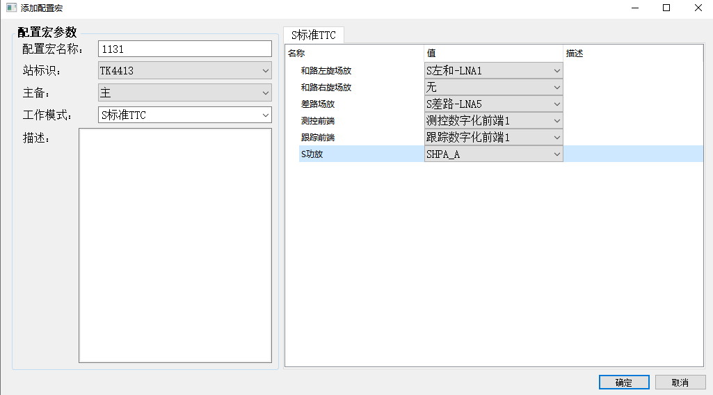

已上面链路为例

#####  第一步

**S馈电单元设置和任务环路不一致，这里配置宏选择S差路开关LNA5,模拟源需要切换到LNA6，如果选择了S-LNA1，那么模拟源就要设置为S-LNA2**

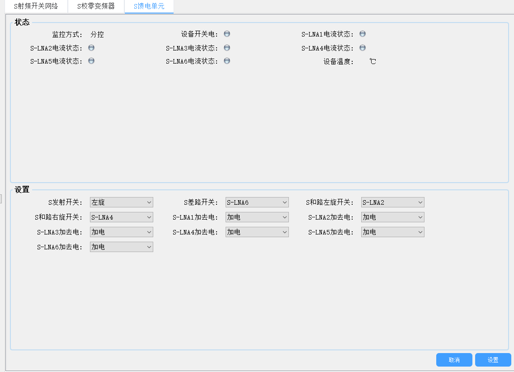

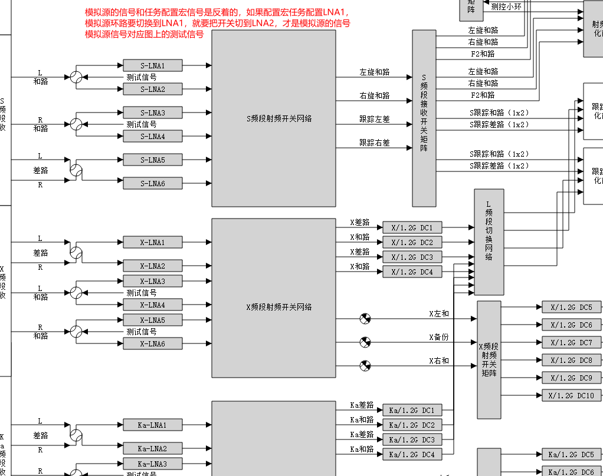

##### 第二步

控制信号输入S-LNA1输入，如果右旋没有选择，右旋使用状态上报的。

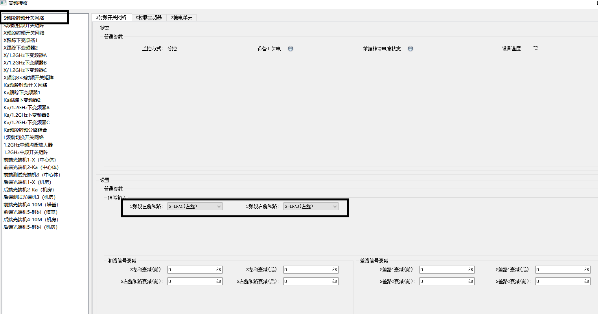

##### 第三步

判断测控数字化前端和跟踪数字化前端是使用第几个，控制S接收开关矩阵，根据是什么前端来选择需要控制的开关，排列组合有4种。

测控前端需要控制3个开关 

情况1，如果是只配置了LNA1和LNA2代表左旋 ，左旋和路/右旋和路/右旋差路的开关 都选择左旋和路，

情况2，如果是只配置了LNA3和LNA4代表右旋 ，左旋和路/右旋和路/右旋差路的开关 都选择右旋和路，

情况3，如果配置了LNA1和LNA2，LNA3和LNA4 ，代表左右旋信号， 左旋和路 ->左旋和路，右旋和路->右旋和路 F2->左旋和路

跟踪前端需要控制4个开关 

情况1，如果是只配置了LNA1和LNA2代表左旋 ，S跟踪和路1，S跟踪和路2的开关 都选择`左旋和路`，

情况2，如果是只配置了LNA3和LNA4代表右旋 ，S跟踪和路1，S跟踪和路2的开关 都选择`右旋和路`，

情况3，如果配置了LNA1和LNA2，LNA3和LNA4 ，代表左右旋信号， S跟踪和路1->`左旋和路` ，S跟踪和路2->`右旋和路` 

差路信号如果选择了LNA5  S跟踪差路1，S跟踪差路2-> `跟踪左差`

差路信号如果选择了LNA6  S跟踪差路1，S跟踪差路2-> `跟踪右差`

**本步骤上面的和任务环路一致，唯一了一个开关配置，如果选择测控前端1，带宽测试开关网络选择，射频模拟源1，同理，选择测控前端2，带宽测试开关网络选择，射频模拟源2**

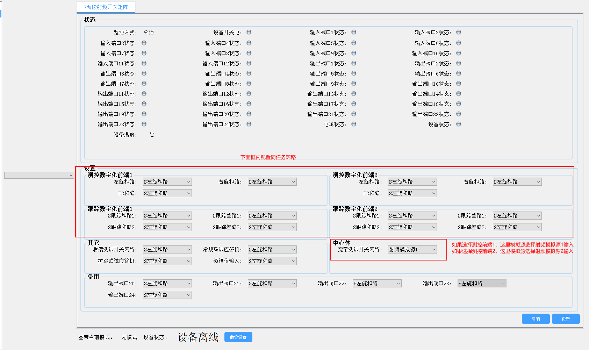

##### 第四步

如果选择`测控前端A` ，第一个开关选择`测控前端A输出`，遥控小环默认选择`功放小环`

如果选择`测控前端B` ，第一个开关选择`测控前端B输出`，遥控小环默认选择`功放小环`

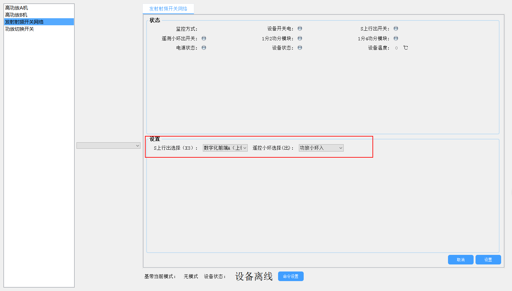

##### 第六步

光口网络配置

给基带和前端下发网络配置

------

以下是和任务环路不一致的地方

------

##### 第七步

在`S射频开关网络`下发`校零关电`命令，目前过程控制命令未找到。

##### 第八步

设置`带宽测试开关网络`过程控制命令`加电`命令，目前过程控制命令未找到。

##### 第九步

设置带宽测试开关网络`S频段模拟源信号输出`,如图所示，S相关通，其他断开，衰减默认10dbm，X/Ka默认选X

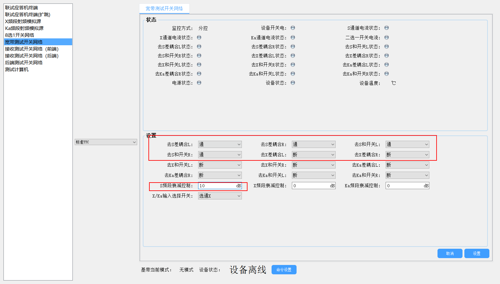

##### 第十步

给测控基带下过程控制命令`工作方式设置`设置工作方式为`射频模拟源有线`，一体化体制下面还分数传和扩频，这里由界面控制

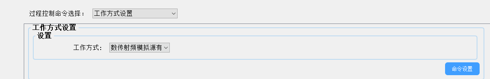

##### 第十一步

给测控基带下发模拟源载波输出，一体化体制下面还分数传和扩频。

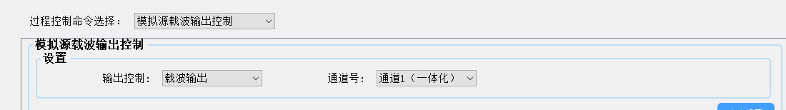

### 2.X频段

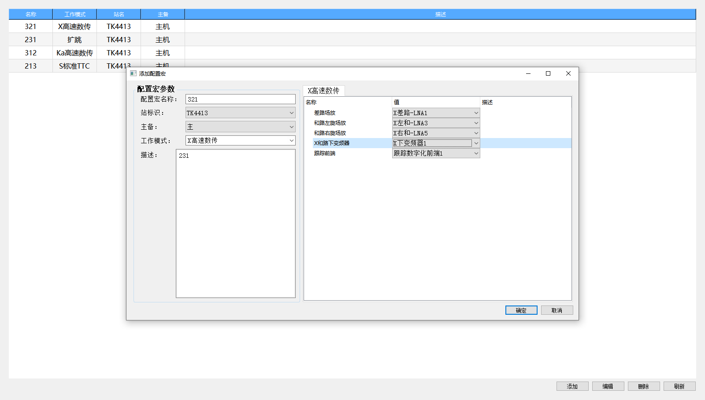

1.开关网络设置，如果是配置了左右旋向 默认左旋

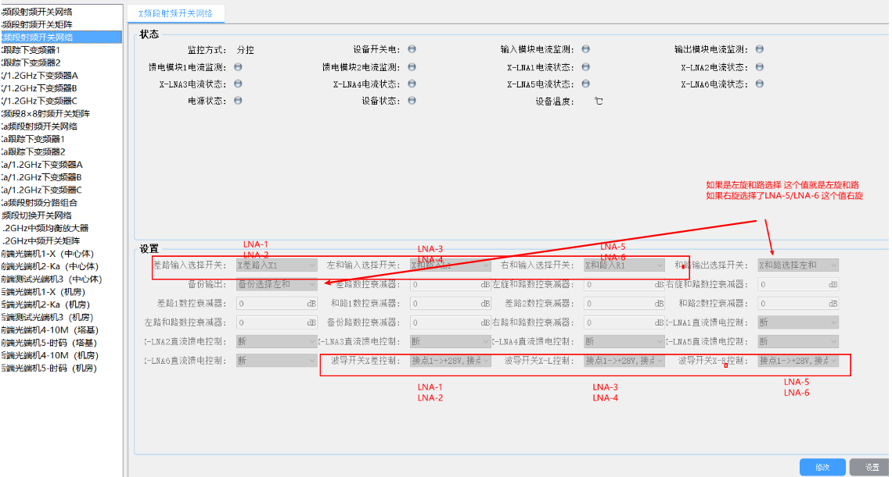

第二步，判断使用那一个下变频器1，如果是`下变频1`就切换 `DC5/DC6`开关,`下变频2`就切换 `DC7/DC8`开关,下变频3`就切换 `DC9/DC10`开关。

以高频箱1举例

情况1，如果是只配置了`LNA3`或`LNA4`代表左旋 ，DC5选择`X左和`，DC6选择`X备份`

情况2，如果是只配置了`LNA5`或`LNA6`代表右旋 ，DC5选择`X右和`，DC6选择`X备份`

情况3，如果配置了`LNA3`或`LNA4`，`LNA5`或`LNA6`，代表`左右旋信号`，DC5选择`X左和`，DC6选择`X右和`

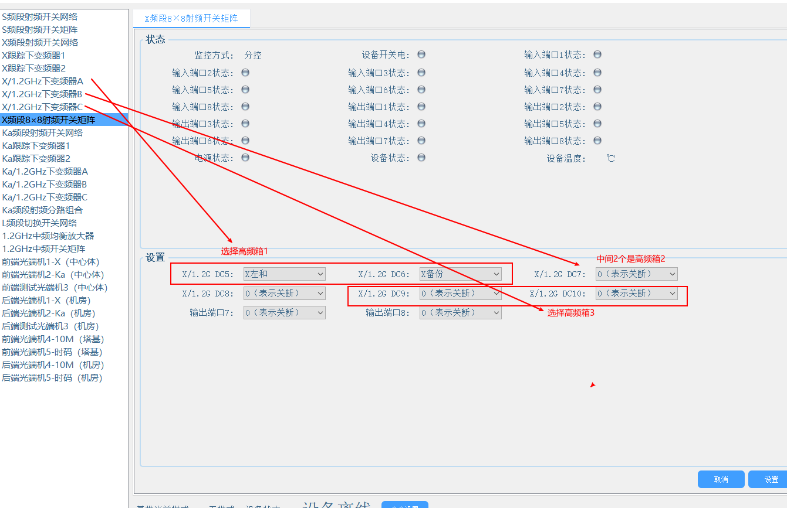

第三步，切换信号给高速基带。

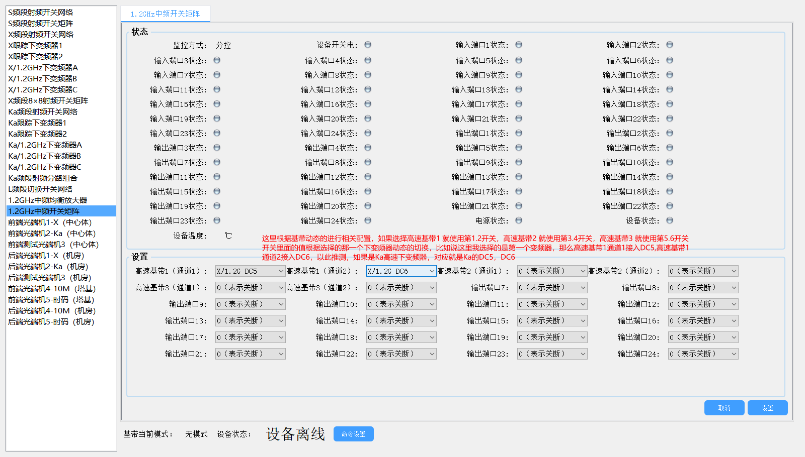

第4步，如果是X频段 这个下发L切换开关网络的单命令

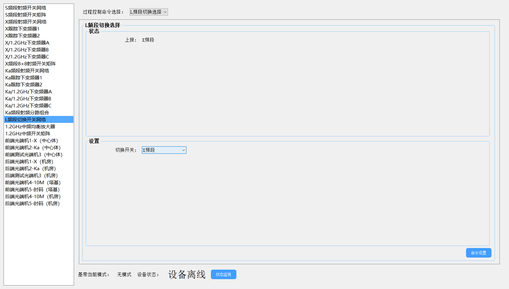

##### 3.Ka频段

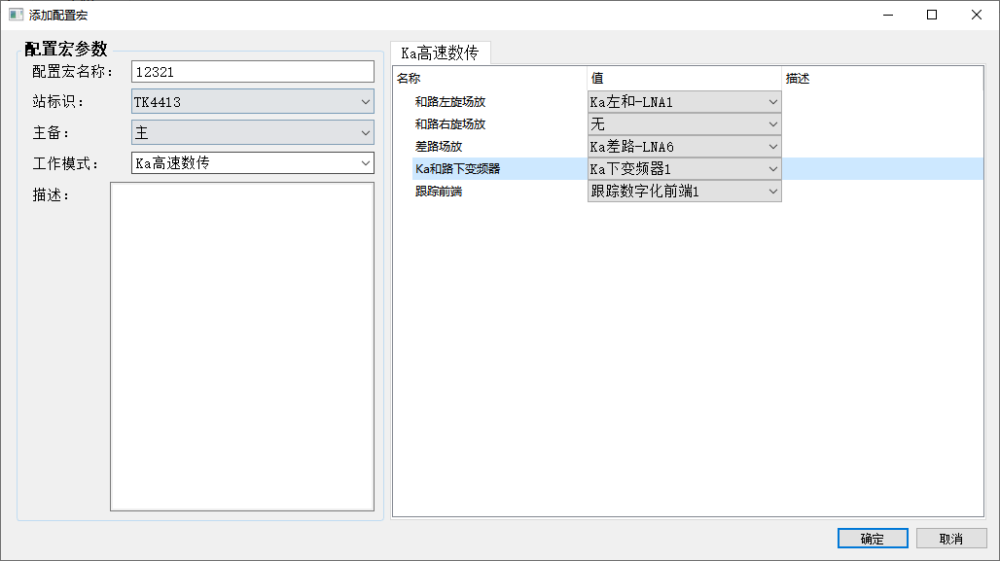

第一步：开关网络设置，如果是配置了左右旋向 默认左旋,这里的设备和X一致，图是采用的X的 ，ka类推

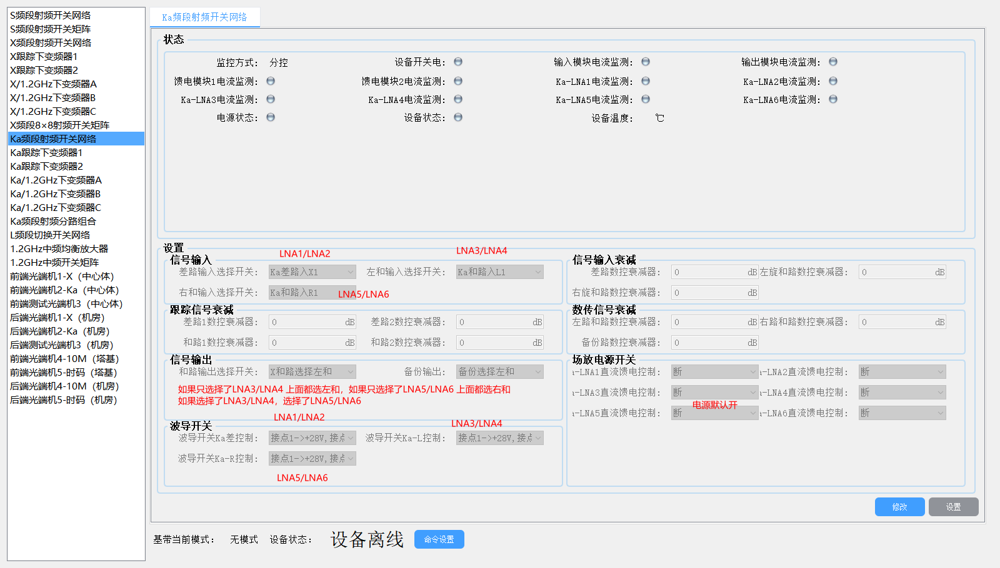

第二步，判断使用那一个下变频器1，如果是`下变频1`就切换 `DC5/DC6`开关,`下变频2`就切换 `DC7/DC8`开关,下变频3`就切换 `DC9/DC10`开关。

以高频箱1举例

情况1，如果是只配置了`LNA3`或`LNA4`代表左旋 ，DC5选择`Ka左和`，DC6选择`X备份`

情况2，如果是只配置了`LNA5`或`LNA6`代表右旋 ，DC5选择`X右和`，DC6选择`X备份`

情况3，如果配置了`LNA3`或`LNA4`，`LNA5`或`LNA6`，代表`左右旋信号`，DC5选择`X左和`，DC6选择`X右和`

第三步，切换信号给高速基带。

第4步，如果是Ka频段 这个下发L切换开关网络的单命令

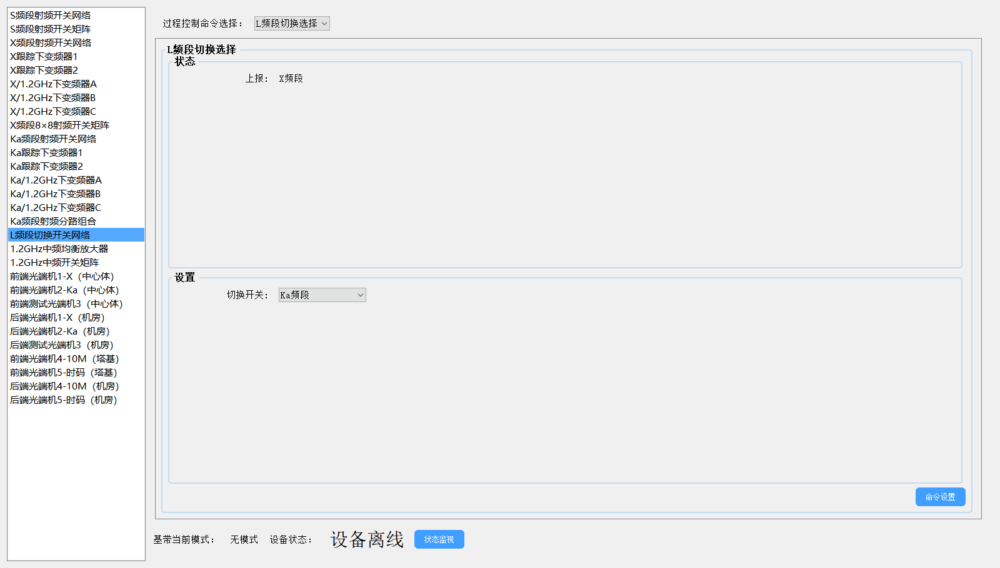

